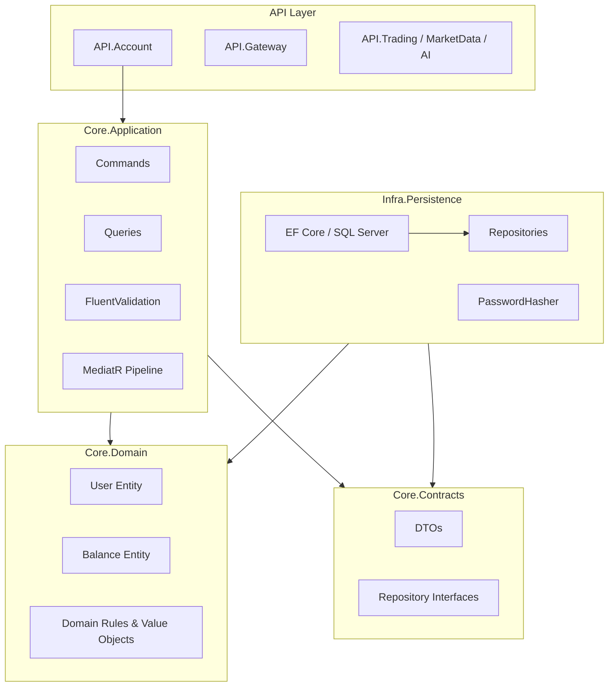

# Trader Analyzer — Project Overview

This document describes what has been built so far in the **Trader Analyzer** solution: the overall architecture, implemented features, and what remains to be done next.

---

## What This Project Is

Trader Analyzer is a **.NET 9 microservices platform** for trading analysis and account management. The solution is organized as a **Clean Architecture** monorepo with separate API services, a shared core layer, infrastructure projects, a web frontend (scaffolded), and test projects.

Work completed to date establishes the **foundation** and implements the **user & account domain** end to end through the application and persistence layers, with **API.Account** wired to use them.

---

## Commit History (High Level)

| Commit | Summary |
|--------|---------|
| `3e486e0` | Initial solution structure — projects, folders, scaffolding |
| `01268d6` | Dockerfiles for all API microservices |
| `228bacb` | User management — domain, CQRS, EF Core persistence, API.Account wiring |

---

## Solution Structure

```
TraderAnalyzer/
├── src/
│   ├── API/                    # Microservice APIs
│   │   ├── API.Gateway/        # API gateway (scaffold)
│   │   ├── API.Account/        # User & account service (partially wired)
│   │   ├── API.Trading/        # Trading service (scaffold)
│   │   ├── API.MarketData/     # Market data service (scaffold)
│   │   └── API.AI/             # AI service (scaffold)
│   ├── Core/                   # Business logic (framework-agnostic)
│   │   ├── Core.Domain/        # Entities, enums, value objects, domain rules
│   │   ├── Core.Application/   # CQRS handlers, validation, mapping
│   │   └── Core.Contracts/     # DTOs and repository/security interfaces
│   ├── Infra/                  # Infrastructure implementations
│   │   ├── Infra.Persistence/  # EF Core, repositories, password hashing
│   │   ├── Infra.Cache/        # Caching (scaffold)
│   │   ├── Infra.Messaging/    # Messaging (scaffold)
│   │   └── Infra.ExternalFeeds/# External data feeds (scaffold)
│   └── Web/                    # Frontend (scaffold)
│       ├── Web.App/
│       ├── Web.Client/
│       └── Web.Components/
├── tests/
│   ├── Tests.Unit/
│   └── Tests.Integration/
├── deploy/                     # Deployment assets (placeholder)
├── NuGet.config                # NuGet source configuration
└── TraderAnalyzer.slnx         # Solution file
```

---

## Architecture

The project follows **Clean Architecture** with **CQRS** (Command Query Responsibility Segregation) via MediatR.



### Dependency direction

- **Core.Domain** — no dependencies on other project layers
- **Core.Contracts** — DTOs and interfaces only
- **Core.Application** — depends on Domain + Contracts; orchestrates use cases
- **Infra.Persistence** — implements Contracts; depends on Domain
- **API.Account** — composition root for the account service; registers Application + Persistence

---

## Technology Stack

| Area | Choice |
|------|--------|
| Runtime | .NET 9 |
| API | ASP.NET Core Web API |
| CQRS / Mediator | MediatR 12 |
| Validation | FluentValidation 11 |
| Mapping | AutoMapper 14 |
| ORM | Entity Framework Core 9 |
| Database | SQL Server |
| Password hashing | ASP.NET Core Identity `PasswordHasher` |
| Containerization | Docker (multi-stage Dockerfiles per API) |

---

## Domain Model

### User

Central aggregate for both **Admin** and **Trader** roles.

| Field | Description |
|-------|-------------|
| `Email`, `UserName` | Unique identifiers (enforced in DB and application layer) |
| `PasswordHash` | Hashed password (never stored in plain text) |
| `Role` | `Admin` or `Trader` |
| `Status` | `Pending`, `Active`, `Suspended`, or `Closed` |
| `FirstName`, `LastName` | Profile fields |
| `PhoneNumber`, `TimeZoneId` | Optional profile fields |
| `DisplayName` | Trader-only display name |
| `PreferredCurrency` | Trader-only ISO 4217 currency code (3 letters) |
| `LastLoginAtUtc` | Updated on successful login |
| `Balance` | One-to-one relationship for traders |

**Factory methods**

- `User.CreateAdmin(...)` — creates an admin in `Active` status
- `User.CreateTrader(...)` — creates a trader in `Pending` status and auto-creates a zero balance

**Lifecycle methods**

- `Activate()`, `Suspend()`, `Close()`, `SoftDelete()`
- `UpdateProfile(...)`, `ChangePassword(...)`
- `RecordLogin()` — only allowed when user is active

All mutating operations enforce domain invariants and throw `DomainException` on invalid state transitions.

### Balance

One balance per trader, tied to their preferred currency.

| Field | Description |
|-------|-------------|
| `Available` | Funds available for use |
| `Reserved` | Funds held (e.g. for open orders) |
| `Total` | Computed: `Available + Reserved` |

**Operations**

- `Credit(amount)` — add to available
- `Debit(amount)` — remove from available (fails if insufficient)
- `Reserve(amount)` — move from available to reserved
- `Release(amount)` — move from reserved back to available
- `CaptureReserved(amount)` — consume reserved funds

### Enums

```text
UserRole:   Admin = 1, Trader = 2
UserStatus: Pending = 0, Active = 1, Suspended = 2, Closed = 3
```

### Value objects & base types

- **`Money`** — amount + 3-letter currency with same-currency arithmetic
- **`Entity`** — base type with `Guid Id`
- **`AuditableEntity`** — adds `CreatedAtUtc`, `UpdatedAtUtc`, soft-delete fields (`IsDeleted`, `DeletedAtUtc`)

---

## Application Layer (CQRS)

All use cases live under `Core.Application/Users/` and are dispatched through MediatR.

### Commands

| Command | Purpose |
|---------|---------|
| `CreateAdminCommand` | Register a new admin user |
| `CreateTraderCommand` | Register a new trader (with balance) |
| `UpdateUserProfileCommand` | Update name, phone, display name, timezone |
| `ChangeUserPasswordCommand` | Change password (hashed before storage) |
| `ActivateUserCommand` | Move user from Pending → Active |
| `SuspendUserCommand` | Suspend an active user |
| `SoftDeleteUserCommand` | Soft-delete and close the user |

Each command has a **handler** and a **FluentValidation validator**.

### Queries

| Query | Returns |
|-------|---------|
| `GetUserByIdQuery` | Single `UserDto` (optionally with balance) |
| `GetUsersQuery` | Filtered list of users by role/status |
| `GetBalanceByUserIdQuery` | `BalanceDto` for a user |

### Cross-cutting concerns

- **`ValidationBehavior`** — runs all FluentValidation validators before handlers execute
- **`ConflictException`** — thrown when email/username already exists
- **`NotFoundException`** — thrown when entity is not found
- **`MappingProfile`** — AutoMapper maps `User` → `UserDto`, `Balance` → `BalanceDto`

### Dependency injection

`Core.Application.DependencyInjection.AddApplication()` registers:

- MediatR (with validation pipeline behavior)
- FluentValidation validators
- AutoMapper

---

## Infrastructure Layer

### Persistence (`Infra.Persistence`)

**DbContext** — `AppDbContext` with:

- `DbSet<User>` and `DbSet<Balance>`
- Fluent API configurations via `IEntityTypeConfiguration`
- Global soft-delete query filter on all `AuditableEntity` types
- Automatic `UpdatedAtUtc` on save

**Repositories**

| Interface | Implementation |
|-----------|----------------|
| `IRepository<T>` | Generic `Repository<T>` |
| `IUserRepository` | `UserRepository` — lookup by email/username, list with filters |
| `IBalanceRepository` | `BalanceRepository` |
| `IUnitOfWork` | `UnitOfWork` — coordinates saves across repositories |

**Security**

- `PasswordHasher` implements `IPasswordHasher` using ASP.NET Core Identity hashing

**Design-time factory**

- `AppDbContextFactory` enables EF Core CLI migrations (`dotnet ef migrations add`)

### Database schema (configured, migrations not yet added)

**Users table**

- Unique indexes on `Email` and `UserName`
- Indexes on `Role` and `Status`
- One-to-one cascade delete to `Balances`

**Balances table**

- Linked to `Users` via `UserId` foreign key

---

## API.Account Service

`API.Account` is the first service wired to the new core layers.

**Registered in `Program.cs`:**

```csharp
builder.Services.AddApplication();
builder.Services.AddPersistence(connectionString);
```

**Configuration** (`appsettings.json`):

- SQL Server connection string pointing to `TraderAnalyzer` database on `localhost:1433`

**Current state:**

- Application and persistence layers are registered
- OpenAPI is enabled in Development
- Controllers exist but only the default `WeatherForecastController` scaffold is present
- **User/account HTTP endpoints are not yet implemented**

**Docker:**

- Multi-stage Dockerfile builds and publishes `API.Account.dll` on .NET 9, exposing port 8080

---

## Other API Services (Scaffold Only)

These services exist with default ASP.NET Core templates and Dockerfiles but do **not** yet integrate with the core user domain:

| Service | Intended responsibility |
|---------|-------------------------|
| `API.Gateway` | Route and aggregate calls to backend services |
| `API.Trading` | Order execution, positions, trading logic |
| `API.MarketData` | Price feeds, candles, market snapshots |
| `API.AI` | Analysis, signals, ML-driven insights |

---

## Web Frontend (Scaffold Only)

Three Blazor/web projects are in the solution but contain only initial scaffolding:

- `Web.App`
- `Web.Client`
- `Web.Components`

---

## Testing (Scaffold Only)

- `Tests.Unit` — unit test project (no tests written yet)
- `Tests.Integration` — integration test project (no tests written yet)

Both projects reference updated package versions aligned with .NET 9.

---

## Configuration & Tooling

| File | Purpose |
|------|---------|
| `NuGet.config` | Pins NuGet source to nuget.org |
| `.gitignore` | Standard .NET gitignore (includes `.env`) |
| `AppDbContextFactory` | Design-time EF Core connection for migrations CLI |

---

## Local Development Setup

### Prerequisites

- .NET 9 SDK
- SQL Server (local or Docker on port 1433)
- Optional: Docker for containerized API runs

### Database

1. Ensure SQL Server is running with credentials matching `appsettings.json`
2. From the `Infra.Persistence` project directory, create and apply migrations:

```bash
dotnet ef migrations add InitialCreate --project src/Infra/Infra.Persistence --startup-project src/API/API.Account
dotnet ef database update --project src/Infra/Infra.Persistence --startup-project src/API/API.Account
```

> **Note:** EF Core migrations have not been created yet. The schema is fully configured via Fluent API; the commands above are the next step.

### Run API.Account

```bash
dotnet run --project src/API/API.Account
```

OpenAPI spec is available at `/openapi/v1.json` in Development.

### Run via Docker

```bash
docker build -f src/API/API.Account/Dockerfile -t trader-analyzer-account .
docker run -p 8080:8080 trader-analyzer-account
```

---

## What Is Done vs. What Is Next

### Done

- [x] Solution structure with microservice layout
- [x] Dockerfiles for all five API services
- [x] Domain model: `User`, `Balance`, enums, `Money` value object
- [x] Domain invariants and lifecycle rules
- [x] CQRS commands and queries for user management
- [x] FluentValidation on all commands/queries
- [x] MediatR pipeline with validation behavior
- [x] AutoMapper DTO mapping
- [x] EF Core persistence with repositories and unit of work
- [x] Soft-delete support with global query filters
- [x] Password hashing abstraction
- [x] API.Account DI wiring (Application + Persistence)

### Not yet done (recommended next steps)

- [ ] EF Core migrations and database seeding
- [ ] HTTP controllers/endpoints in `API.Account` (UsersController, etc.)
- [ ] Global exception handling middleware (map `DomainException`, `NotFoundException`, `ValidationException` to HTTP status codes)
- [ ] Authentication & authorization (JWT, role-based access)
- [ ] Integration with `API.Gateway`
- [ ] Unit and integration tests for domain and handlers
- [ ] Trading, market data, and AI service implementations
- [ ] Web frontend UI
- [ ] CI/CD pipeline and deployment manifests in `deploy/`

---

## Design Decisions

1. **Rich domain model** — business rules live on entities (`User`, `Balance`), not in handlers. Handlers orchestrate; entities enforce invariants.

2. **Trader vs. Admin separation** — same `User` entity with role-based behavior. Traders get a balance and extra profile fields; admins start active, traders start pending.

3. **Soft delete** — users are never hard-deleted. `IsDeleted` + global EF query filter keeps deleted records out of normal queries.

4. **Contracts layer** — repository interfaces and DTOs are separated from Domain so Application does not depend on EF Core.

5. **Password security** — plain passwords never touch the domain or database. Hashing happens in the application handler via `IPasswordHasher`.

---

## Security Note

`appsettings.json` and `AppDbContextFactory` contain a **local development** SQL Server password. Do not use these credentials in production. Prefer environment variables or a secrets manager for deployed environments.

---

*Last updated: August 2026 — reflects commit `228bacb` on `master`.*
